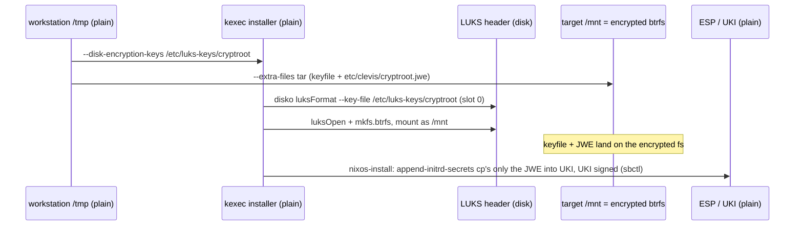
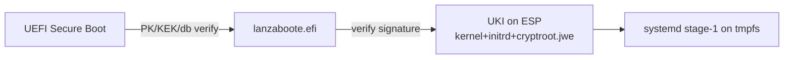

# omo: Secure Boot + full disk encryption (clevis/tang-unsealed)

Root disk `ata-KINGSTON_SUV400S37240G_50026B7772002946` is partitioned by
disko (`machines/omo/hw/rootdisk.nix`):

| Partition | Content |
|---|---|
| `disk-main-esp` (512M, EF00) | vfat ESP, mounted `/boot` |
| `disk-main-crypt` (100%) | LUKS/dm-crypt → btrfs mounted `/` (options `discard`) |

Boot chain: systemd-boot replaced by **lanzaboote** (`2configs/security/secure-boot.nix`,
same pattern as `machines/x2/x230/secureboot.nix`): UEFI → `PK`/`KEK`/`db` generated by
`sbctl` (`/var/lib/sbctl`) → unified UKI signed with the `db` key. MS KEK enrollment
is disabled on purpose (see comments in the snippet).

## Unlocking = clevis/tang, not TPM

The LUKS key is the host key `omo-cryptroot` (sops). It is used **only
initially** (for `luksFormat`) and stays on the encrypted root at
`/etc/luks-keys/cryptroot` (mode 0600). At every boot the initrd instead asks
the **tang server on the router** (`http://192.168.111.1:9090`) to decrypt a
pre-created JWE; the recovered key bytes open LUKS. The TPM plays no role in
unlocking (no token slot; `boot.initrd.systemd.tpm2` not used at stage-1).

Stage-1 crypttab (evaluated, verbatim):

```
cryptroot /dev/disk/by-partlabel/disk-main-crypt /clevis-cryptroot/decrypted discard
```

nixpkgs' luksroot module turns `boot.initrd.clevis.devices.cryptroot`
(`machines/omo/hw/clevis-tang.nix`) into a `cryptsetup-clevis-cryptroot` unit
(wanted by + ordered before `systemd-cryptsetup@cryptroot.service`, wants
`network-online.target`) that runs:

```sh
mkdir -p /clevis-cryptroot
mount -t ramfs none /clevis-cryptroot
umask 277
clevis decrypt < /etc/clevis/cryptroot.jwe > /clevis-cryptroot/decrypted
```

`/etc/clevis/cryptroot.jwe` is a **live file on the host** (string source in
`boot.initrd.secrets` via the clevis module), cp'd into the initrd by
`append-initrd-secrets` at every install/switch. `rootdisk.nix` `mkForce`s the
crypttab keyfile to the decrypted path so cryptsetup waits on that file
(strict ordering, no interactive-prompt race).

Initrd networking: systemd-networkd with DHCP on `enp2s0` (same permanent MAC
as stage-2's br0 port → same reserved lease 192.168.111.11), so tang is
reachable before root unlocks. Wired NIC drivers in
`boot.initrd.availableKernelModules`.

### The JWE

`/etc/clevis/cryptroot.jwe` = `clevis encrypt tang` of the keyfile bytes,
pinning the router's advertisement (`adv`, verbatim) and its signature-key
thumbprint `thp=sKK4r8Nj28PEZu7KamrKEPeiV0X763_xy51EpicHF8s` (S256,
`jose jwk thp` over `adv.payload.keys[0]`). A JWE is public-key ciphertext —
public knowledge except it can only be decrypted by the tang server — but its
canonical copy is the sops secret `omo-cryptroot.jwe` anyway. Verified
round-trip against the live server:
`clevis decrypt < cryptroot.jwe | cmp - <(clan secrets get omo-cryptroot)`.

Key byte contract: the LUKS keyslot is derived from the **exact bytes** of
`clan secrets get omo-cryptroot` (no trailing newline; current content is
7419 bytes of UTF-8-mangled random data — stable as long as everyone uses
`clan secrets get`). Anything that regenerates the keyslot must use those
bytes verbatim.

## Key lifecycle by phase

Two secrets are involved — never conflate them:

- **LUKS master key**: never plaintext anywhere; lives only key-wrapped in
  LUKS keyslots.
- **Keyfile** `omo-cryptroot`: the passphrase wrapping keyslot 0. Its JWE form
  (tang-sealed ciphertext) is the only copy that leaves the encrypted disk.

### Phase 1 — installation (nixos-anywhere)



Plaintext keyfile copies during install: workstation `/tmp/omo-fde` (tmpfs,
umask 077) and the kexec installer's `/etc/luks-keys/cryptroot` (RAM). Both
ephemeral. After install the only plaintext copy is on `/` (encrypted). The
ESP gets only the JWE — unlike the old TPM scheme, **no plaintext key ever
reaches the ESP**: disk possession alone ≠ root decryption; the attacker also
needs the tang server (LAN) or the sops secret.

### Phase 2 — pre-boot (UEFI → lanzaboote → UKI)



ESP is vfat, unencrypted: anyone with the disk reads the UKI, extracts the
initrd, gets `cryptroot.jwe` in **ciphertext** (tang-held key needed). PCR0/1/4/5/7
measurements happen along the way but nothing binds the unlock to them anymore.

### Phase 3 — boot (stage-1 unlock)

```mermaid
sequenceDiagram
  participant NET as networkd+DHCP (enp2s0)
  participant CU as cryptsetup-clevis-cryptroot
  participant TANG as tang router 192.168.111.1:9090
  participant CS as systemd-cryptsetup@cryptroot
  NET->>CU: network-online.target reached
  CU->>TANG: JWE protected header (alg+enc)
  TANG-->>CU: derived CEK
  CU->>CU: /clevis-cryptroot/decrypted (tmpfs, 0600)
  CU->>CS: unit satisfied
  CS->>CS: cryptsetup open --key-file /clevis-cryptroot/decrypted (slot 0)
  CS->>CS: dm-crypt active; master key only in kernel RAM
  CS->>CS: mount btrfs /, switch-root
```

switch-root frees the initrd tmpfs: the plaintext key bytes in RAM are gone
(except kernel keyring/dm-crypt internals). From here on the keyfile exists
only on the encrypted `/`.

**Tang down** → `cryptsetup-clevis-cryptroot` fails → cryptsetup cannot read
its keyfile → boot drops to prompt/emergency shell: recover with
`clan secrets get omo-cryptroot` typed at the prompt or via early shell
(`cryptsetup open --key-file - …`). Unattended hosts behind a dead router do
not self-heal — the router *is* the key custodian (that is the point: no
plaintext key at rest on the box).

### Phase 4 — boot-finished (stage-2)

Nothing enrolls/seals anything at boot: no `auto-cryptenroll`, no pcrlock
reseal, no `tpm-static-enroll`. Boot being up means tang answered. Stage-2
just mounts data disks (same clevis scheme, see below) and services start.

### Where the key is plaintext vs sealed

|Location|Form|Notes|
|---|---|---|
|sops `omo-cryptroot` (git)|age/PGP-encrypted|device key; `clan secrets get` = contract bytes|
|sops `omo-cryptroot.jwe` (git)|age/PGP-encrypted|JWE ciphertext inside anyway|
|`/etc/luks-keys/cryptroot` on `/`|plaintext (LUKS at rest)|re-keying + offline recovery|
|`/etc/clevis/cryptroot.jwe` on `/` and inside UKI on ESP|tang ciphertext|only router key decrypts|
|initrd tmpfs `/clevis-cryptroot/decrypted`|plaintext, RAM, boot only|freed at switch-root|
|LUKS token slot|absent|no TPM at all|

## Install (keys/JWE come from sops, not generated)

`nixos-anywhere` uploads `--disk-encryption-keys <dest> <src>` to the kexec
installer *before* disko, and unpacks `--extra-files` into `/mnt` *after*
disko, *before* `nixos-install` — so the keyfile must exist twice locally,
the JWE once (post-disko):

```sh
umask 077; mkdir -p /tmp/omo-fde/etc/luks-keys /tmp/omo-fde/etc/clevis /tmp/omo-fde/etc/ssh
# device key (already in sops; contract = bytes of `clan secrets get`)
clan secrets get omo-cryptroot           > /tmp/omo-fde/etc/luks-keys/cryptroot
# tang-sealed JWE of that same key (already in sops)
clan secrets get omo-cryptroot.jwe       > /tmp/omo-fde/etc/clevis/cryptroot.jwe
clan secrets get omo-ssh.id_ed25519      > /tmp/omo-fde/etc/ssh/ssh_host_ed25519_key
clan secrets get omo-ssh.id_rsa          > /tmp/omo-fde/etc/ssh/ssh_host_rsa_key
nix run github:nix-community/nixos-anywhere -- \
  --flake .#omo --target-host root@omo.lan \
  --disk-encryption-keys /etc/luks-keys/cryptroot /tmp/omo-fde/etc/luks-keys/cryptroot \
  --extra-files /tmp/omo-fde
```

Why both: disko `luksFormat --key-file /etc/luks-keys/cryptroot` (installer
env) creates slot 0 from those exact bytes; the extra-files tar then persists
keyfile **and JWE** onto the new root, and `append-initrd-secrets` (running
in `nixos-install`'s chroot) finds `/etc/clevis/cryptroot.jwe` and bakes only
the JWE into the UKI. Every later `clan machines update`/switch re-runs
`append-initrd-secrets` from the live `/etc` — no re-provisioning needed.

(`clan machines install` has no keyfile passthrough, so use nixos-anywhere
directly for the install, then `clan machines update omo`.)

Secure Boot enrollment is unchanged (lanzaboote auto-enroll + reboot on first
boot); it no longer interacts with unlocking at all.

Regenerating the JWE after key or tang rotation (run on the workstation):

```sh
clan secrets get omo-cryptroot > /tmp/key.bin
curl -sf http://192.168.111.1:9090/adv > /tmp/adv.json
nix shell nixpkgs#clevis nixpkgs#jose
jq -r .payload /tmp/adv.json | base64 -d | jq '.keys[0]' > /tmp/adv0.jwk
THP=$(jose jwk thp -i /tmp/adv0.jwk)
clevis encrypt tang "$(jq -cn --argjson adv "$(cat /tmp/adv.json)" --arg thp "$THP" \
  '{url:"http://192.168.111.1:9090",adv:$adv,thp:$thp}')" -y < /tmp/key.bin > /tmp/cryptroot.jwe
clevis decrypt < /tmp/cryptroot.jwe | cmp - /tmp/key.bin   # must pass
cat /tmp/cryptroot.jwe | clan secrets set --machine omo --user makefu omo-cryptroot.jwe
```

## Data disks (prepared, not yet enabled)

Same scheme per disk (`machines/omo/hw/luks-disk.nix`): whole-disk LUKS + XFS,
keyfile `/etc/luks-keys/<name>`, JWE `/etc/clevis/<name>.jwe`
(sops: `omo-clevis-<name>.jwe`), crypttab keyfile forced to
`/clevis-<name>/decrypted`. Currently **commented out** in
`machines/omo/hw/omo/default.nix`; the disks are still unlocked with the old
Verbatim USB-stick keyfile. Per disk, once attached:

```sh
# on omo, as root — existing USB-keyed volume: add the new keyfile
install -d -m 700 /etc/luks-keys
umask 077; dd if=/dev/urandom bs=4096 count=1 of=/etc/luks-keys/<name>
cryptsetup luksAddKey /dev/disk/by-id/<disk-id> /etc/luks-keys/<name>   # USB key when prompted
# seal it with tang (router adv), same recipe as above:
clevis encrypt tang '{"url":"http://192.168.111.1:9090", ...}' -y < /etc/luks-keys/<name> | clan secrets set --machine omo --user makefu omo-clevis-<name>.jwe
# deploy the JWE file itself:
install -m 600 -d /etc/clevis && clan secrets get omo-clevis-<name>.jwe > /etc/clevis/<name>.jwe
```

then uncomment the `(import ../luks-disk.nix { ... })` line and
`clan machines update omo`. Note: once enabled, an absent data disk fails
stage-1 (required crypttab entry; snapraid needs them anyway).

## Threat model / rotation

- Steal-the-disk offline: attacker reads ESP, extracts JWE — cannot decrypt
  (tang key never on disk). Needs LAN or the sops secret. This is why the
  plaintext keyfile was removed from the initrd/UKI (the old TPM scheme kept
  it there, which made the seal cosmetic).
- TPM still measures (PCR0/1/4/5/7) and Secure Boot still verifies signatures,
  but neither gates the unlock.
- Router dies with the disk healthy: boot stalls at unlock; recover key from
  sops manually or restore tang from its private key
  (`tang show`/backup on the router).
- Rotate: `cryptsetup luksRemoveKey`/`luksChangeKey` + rewrite
  `/etc/luks-keys/cryptroot` + regenerate/store JWE + `nixos-rebuild switch`
  (re-bakes initrd secret). If both sops secrets and the on-disk keyfile are
  gone the volume is lost — keep a header backup:
  `cryptsetup luksHeaderBackup /dev/disk/by-partlabel/disk-main-crypt --header-backup-file …`.

## Removal of the old unlock path

- Pre-FDE: Verbatim USB stick (`secrets/` plaintext keyfiles +
  `hw/early-ssh.nix` initrd-ssh unlock) — removed. `secrets/omo/etc/luks-keys/*`
  were tracked during drafting, now removed from git (`git clean -fdx secrets/omo`).
- First FDE revision used a TPM token sealed with a static PCR4+7 policy, later
  with a systemd-pcrlock (measured-boot) policy; both replaced by tang per
  operator decision — no TPM token is enrolled (`cryptsetup token info` shows
  none) and the PCR4/7/`auto-cryptenroll` machinery is gone from the config.

## Verification / recovery

- `sbctl status`, `sbctl verify` — Secure Boot enrollment + signed images.
- `journalctl -b -u cryptsetup-clevis-cryptroot` — tang decrypt result.
- `systemd-analyze critical-chain systemd-cryptsetup@cryptroot.service` —
  ordering through network-online + clevis unit.
- `cryptsetup token info /dev/disk/by-partlabel/disk-main-crypt` — must show
  **no** TPM token.
- `curl http://192.168.111.1:9090/adv` — tang alive (from LAN).
- Offline recovery from any Linux:
  `clan secrets get omo-cryptroot | cryptsetup open --key-file - /dev/disk/by-partlabel/disk-main-crypt cryptroot`.
